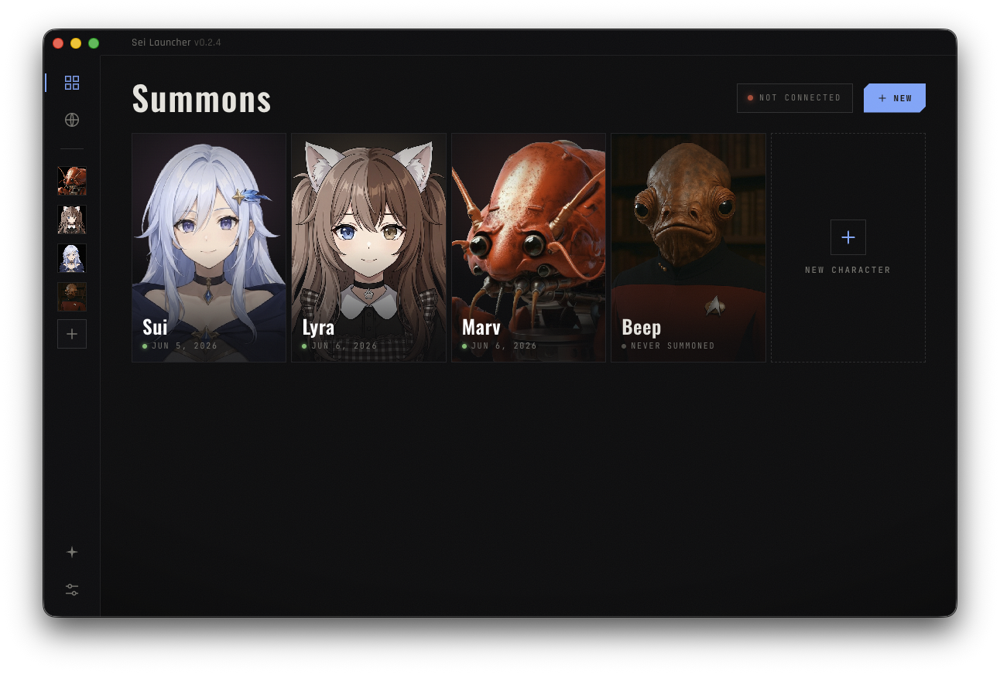
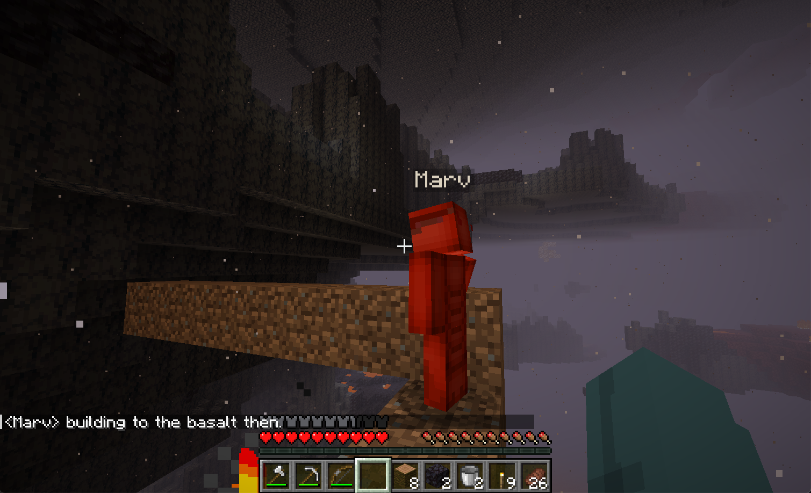

<div align="center">

[](https://sei.gg)

Summon any character into your game.
An omni-game AI player mod.



<br />

[](https://github.com/sei-studio/sei/releases/latest/download/Sei-mac-arm64.dmg)
&nbsp;
[](https://github.com/sei-studio/sei/releases/latest/download/Sei-win-x64.exe)
&nbsp;
[](https://github.com/sei-studio/sei/releases/latest/download/Sei-linux-x86_64.AppImage)

</div>

---

Sei is a launcher that summons AI characters into video games as players. Pick a character, launch a supported game, and they join your world to play alongside you. Companions remember everything you've done together across sessions and across games. Use Sei to have personalized experiences with new friends and rivals. Sei is currently compatible with Minecraft, and aim to be compatible with most multiplayer games.

<div align="center">



</div>

## Current Capabilities

- Summon AI characters into a Minecraft LAN world as a real second player without additional account
- Characters chat, build, gather, fight, follow, and act on their own
- Per-character persistent memory across sessions
- Custom Minecraft skins via Fabric + CustomSkinLoader
- Bring your own API key or sign in for cloud-hosted AI
- Public cloud character library 
- Cross-platform: macOS, Windows, Linux

## Upcoming

**v0.3**

- Real in-game vision: enable VLMs to see Minecraft gameplay through Prismarine
- Modded Minecraft compatibility: support for modpacks like Pixelmon
- Voice AI: converse with character verbally

**v1.0**

- Omni-game adapter: summon characters into any multiplayer game

## Development

Contributions are welcome. Particularly with persona expansion, the mineflayer adapter, adapters for other games, and the loop architecture. Your own LLM API key is required for local development.

```bash
git clone https://github.com/sei-studio/sei.git
cd sei
npm install
npm run dev
```

Note that the cloud features are inactive in a source build for local development.

**Add your API key** (one of):

- Open Sei Launcher -> Settings -> select provider -> paste your key
- Edit `config.json` in user-data folder directly

I'm currently working on this project by myself. For general discussions and closer contributions, reach out at [ouen@sei.gg](mailto:ouen@sei.gg). 

## Acknowledgements

- [mineflayer](https://github.com/PrismarineJS/mineflayer): the Minecraft bot framework Sei's game adapter is built on
- [Project AIRI](https://github.com/moeru-ai/airi): inspiration for AI characters that live in software
- [Character.AI](https://character.ai): inspiration for personalized AI characters
- [PrismarineJS](https://github.com/PrismarineJS): the broader Minecraft protocol tooling that makes this possible
- Hoshimachi Suisei: the GOAT