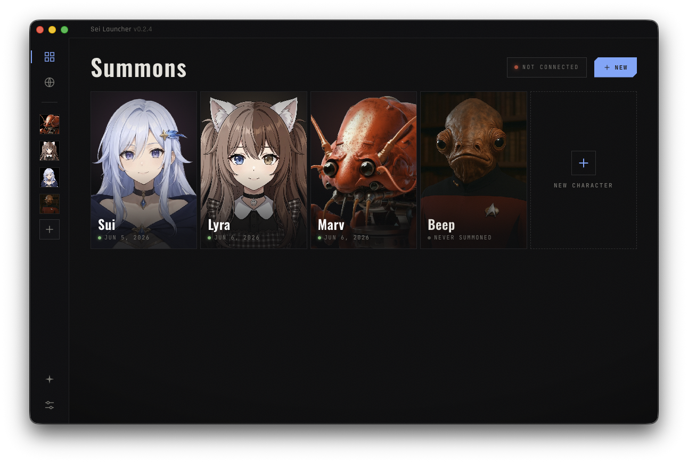
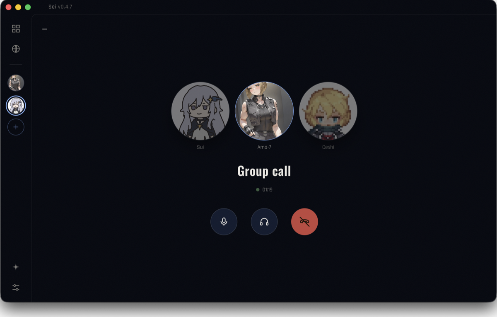
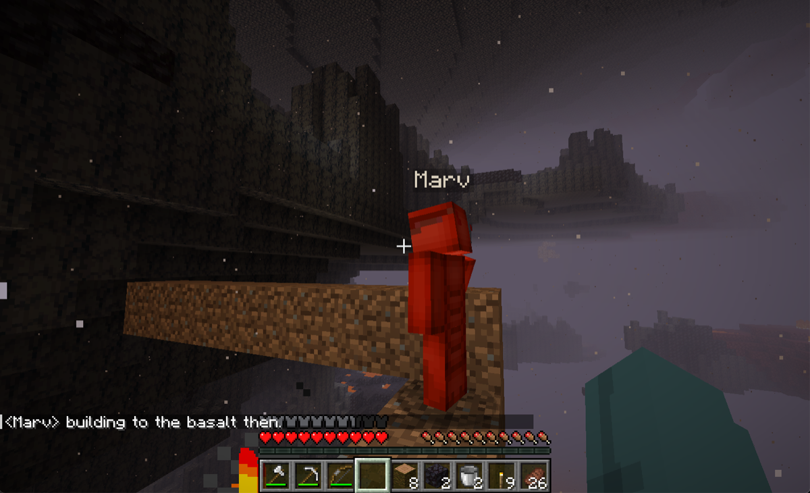
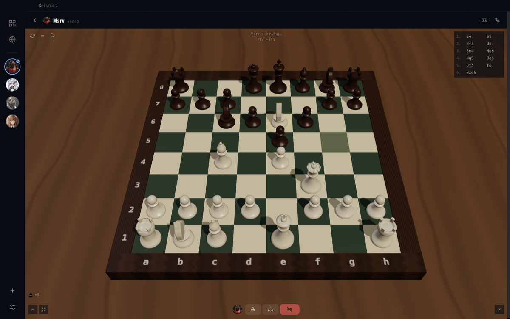

<div align="center">

[](https://sei.gg)

Play games with AI gamers.
An omni-game AI player mod.



<br />

[](https://github.com/sei-studio/sei/releases/latest/download/Sei-mac-arm64.zip)
&nbsp;
[](https://github.com/sei-studio/sei/releases/latest/download/Sei-win-x64.exe)

<sub>On an Intel Mac? [Download the Intel build](https://github.com/sei-studio/sei/releases/latest/download/Sei-mac-x64.zip).</sub>

</div>

---

Sei is an AI game companion launcher ([sei.gg](https://sei.gg)) that summons AI characters into video games as real players, not chatbots. Pick a character, launch a supported game, and they join your world to play alongside you. Companions remember everything you've done together across sessions and across games. Use Sei to have personalized experiences with new friends and rivals. Sei plays Minecraft and its own in-app minigames today, and aims to support most multiplayer games.

<div align="center">

<table>
<tr>
<td></td>
<td></td>
<td></td>
</tr>
<tr>
<td align="center"><sub>Voice call</sub></td>
<td align="center"><sub>Existing games</sub></td>
<td align="center"><sub>In-app minigames</sub></td>
</tr>
</table>

</div>

## Current Capabilities

- Minecraft: companions join a LAN world as a real second player, no extra account needed
- In-app minigames: chess, with more on the way
- Voice calls, solo or group
- In-app chat
- Persistent memory across sessions and games
- Generated companions matched to you, or bring your own
- Custom Minecraft skins and in-game vision
- Bring your own API key or sign in for cloud-hosted AI
- macOS and Windows

## Upcoming

**v0.5 releases**

- More minigames

**v1.0**

- Omni-game adapter: summon characters into any multiplayer game

To suggest a game, use the suggest tile on the Games screen in app.

## Development

```bash
git clone https://github.com/sei-studio/sei.git
cd sei
npm install
npm run dev
```

No `.env` needed. Cloud traffic routes through the Sei proxy, so sign-in, cloud characters, and cloud AI work from a plain clone. Use `.env.example` only to point at your own proxy or Supabase project.

To run local mode instead, open Settings, pick a provider, and paste your own LLM API key.

Help is welcome with:

- Improving the Minecraft experience
- Adding support for new games
- Better personality and memory

I work on Sei alone. To get involved, reach out at [ouen@sei.gg](mailto:ouen@sei.gg).

## Acknowledgements

- [mineflayer](https://github.com/PrismarineJS/mineflayer): the Minecraft bot framework Sei's game adapter is built on
- [Project AIRI](https://github.com/moeru-ai/airi): inspiration for AI characters that live in software
- [Character.AI](https://character.ai): inspiration for personalized AI characters
- [Neuro-sama](https://vedal.ai/): inspiration for an AI that plays games with people
- [PrismarineJS](https://github.com/PrismarineJS): the broader Minecraft protocol tooling that makes this possible
- Hoshimachi Suisei: the GOAT
