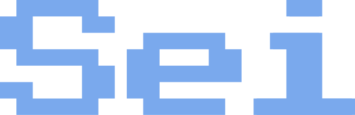
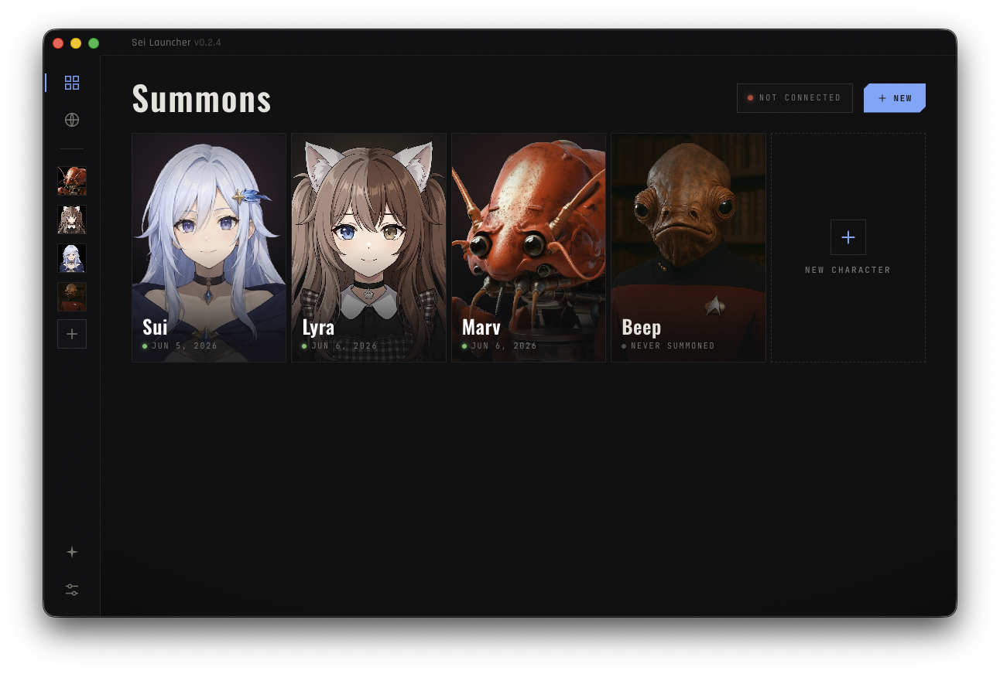
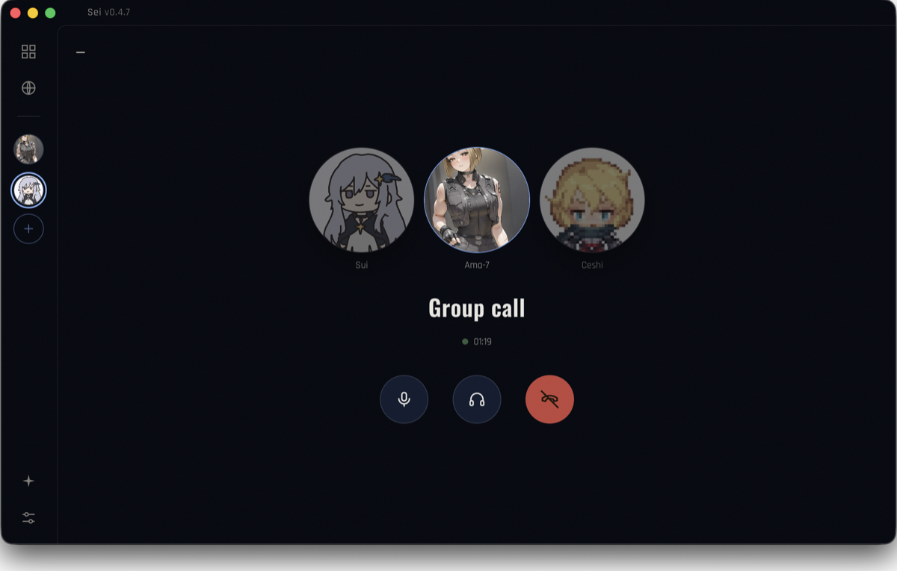
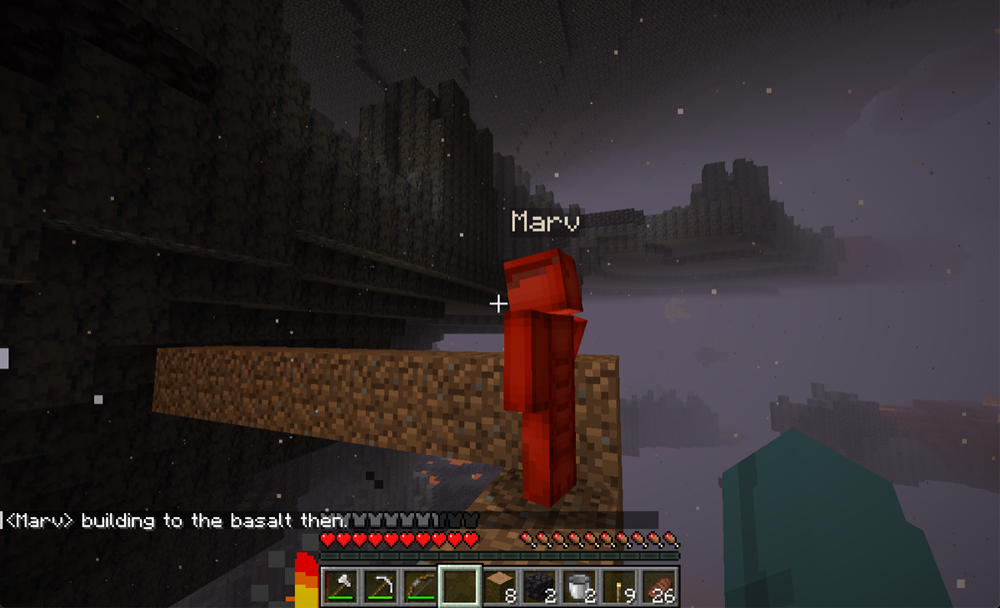
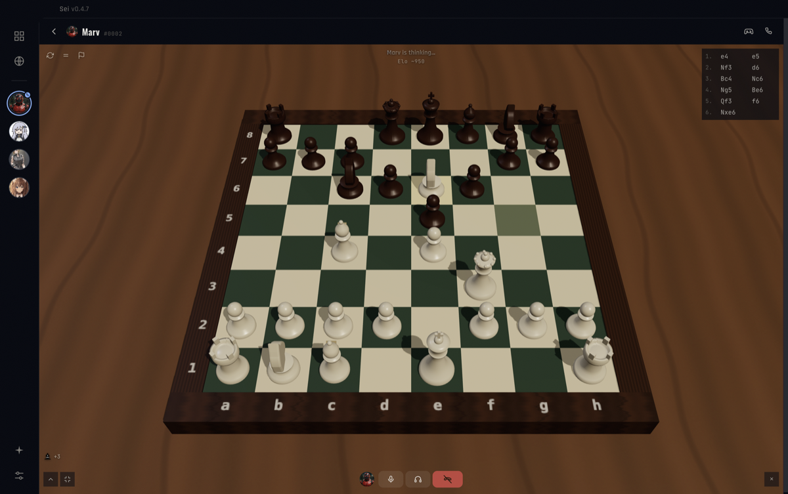

<div align="center">

[](https://sei.gg)

An AI gaming companion.
Companions that play your games with you, talk on voice, and remember you.



<br />

[](https://github.com/sei-studio/sei/releases/latest/download/Sei-mac-arm64.dmg)
&nbsp;
[](https://github.com/sei-studio/sei/releases/latest/download/Sei-win-x64.exe)

<sub>On an Intel Mac? [Download the Intel build](https://github.com/sei-studio/sei/releases/latest/download/Sei-mac-x64.dmg).</sub>

</div>

---

Sei ([sei.gg](https://sei.gg)) is a desktop app for macOS and Windows. You pick a companion, then chat, call, and play games together. Sei can match you with companions, you can make your own, or you can import one you already talk to on another platform. Each companion has its own personality and a long-term memory that follows it from game to game.

<div align="center">

<table>
<tr>
<td></td>
<td></td>
<td></td>
</tr>
<tr>
<td align="center"><sub>Voice calls</sub></td>
<td align="center"><sub>Your games</sub></td>
<td align="center"><sub>In-app games</sub></td>
</tr>
</table>

</div>

## What it does

**Games**

- **Minecraft (Java Edition):** your companion joins your world opened to LAN as its own player, with its own skin. It follows, mines, gathers, crafts, builds, fights, and can see what is around it. More than one companion can join the same world.
- **Stardew Valley:** your companion comes to your farm. It farms, clears land, waters and harvests, ships produce, fishes, and hands you items.
- **Don't Starve Together:** your companion joins the world you host as a survivor it picks itself. It gathers, builds, keeps the fire going, fights, and warns you about danger.
- **Chess:** play a game against your companion. Its strength comes from a chess engine and adapts to how you play. It talks while you play.
- **Draw!:** take turns sketching and guessing with your companion.
- **Roblox:** coming soon.

**Everywhere**

- **Voice calls:** solo or group calls in more than 70 languages, during a game or on their own.
- **Backseat:** share your screen on a call and your companion watches and talks about what you are doing.
- **Long-term memory:** companions remember you across chats, calls, and games.
- **Knowledge import:** add text files (memories from another platform, facts about you) that a companion always knows.
- **Avatar overlay:** an always-on-top window with your companion's portrait or an imported Live2D model.
- **Web search:** companions can look things up and read pages, and say so before they do.

## Download

Get Sei from [sei.gg](https://sei.gg) or [GitHub Releases](https://github.com/sei-studio/sei/releases/latest). Builds are signed for macOS (Apple Silicon and Intel) and Windows (x64). The app updates itself.

## Requirements

- **Computer:** macOS on Apple Silicon or Intel, or Windows x64.
- **Minecraft:** Java Edition, 1.8 to 26.3 (most releases in that range). Bedrock, console, and mobile are not supported. On first use, Sei adds a "Sei" profile to the Minecraft Launcher so your companion shows up with its skin.
- **Stardew Valley:** PC version 1.6.14 or newer, from Steam or GOG. Sei installs SMAPI and its helper mod for you.
- **Don't Starve Together:** the Steam version, on a world you host. Sei installs its helper mod. One companion per world for now. Friends who join need nothing installed.

## Plans, your own key, or local models

- **Cloud (sign in):** no API key and no setup. There is a free tier and paid plans. See [sei.gg](https://sei.gg) for current plans.
- **Your own API key:** run Sei on your own key with Anthropic, OpenAI, DeepSeek, Qwen, Google Gemini, Grok, or OpenRouter.
- **Local models:** run fully on your machine with [Ollama](https://ollama.com). No key needed. Local voice packs and on-device speech recognition are available too.

## Privacy

Companion memory is stored as files on your computer, not in the cloud. On the cloud plans, messages go through Sei's server to the AI model to get replies. With your own key they go straight to the provider you chose, and with Ollama they stay on your machine. Usage analytics can be turned off in Settings.

## Building from source

You need Node.js 22 and npm.

```bash
git clone https://github.com/sei-studio/sei.git
cd sei
npm install
npm run dev
```

No `.env` is needed. Sign-in, cloud companions, and cloud AI work from a plain clone through the Sei proxy. Copy `.env.example` only to point at your own proxy or Supabase project. To use your own key instead, pick a provider in Settings.

Other scripts:

| Command | What it does |
|---|---|
| `npm run dev:tools` | Dev run with DevTools and the log/prompt viewer at localhost:7077 |
| `npm test` | Unit tests (Vitest) |
| `npm run typecheck` | TypeScript check |
| `npm run build` | Build without packaging |
| `npm run dist:mac` / `npm run dist:win` | Package for macOS or Windows |

Notes:

- `npm run dev` downloads the Live2D Cubism Core if it is missing. It is Live2D's proprietary runtime and is never committed to the repo.
- The macOS helpers (`native/mac-audio-tap` for screen audio in backseat, `native/mac-input`) are Swift and build only on a Mac. On other systems the scripts skip them.
- Game runtimes (Minecraft's mineflayer stack, the Stardew and DST helper mods) ship as game packs that the installed app downloads on first use. In dev they load from the repo.
- The Stardew Valley mod compiles only against the game's own assemblies, so its build output is checked in under `native/stardew-mod/assets/`.
- `npm run dist:linux` builds an AppImage. Linux is not an official platform: it is experimental and untested for release.

## Project layout

Sei is an Electron app with a React renderer, a main process, and a forked bot process that runs the companion's brain and game adapters (`src/bot`). Shared contracts live in `src/shared`, and the helper mods for Stardew Valley and Don't Starve Together live in `native/`. [CLAUDE.md](CLAUDE.md) is the full contributor guide: architecture, invariants, and pitfalls.

## Contributing

Help is welcome anywhere in the repo, for example:

- Better play in the supported games
- Support for new games
- Better personality and memory

Open an issue or a pull request. To get involved with the product side, write to [ouen@sei.gg](mailto:ouen@sei.gg).

## License

Sei is licensed under [AGPL-3.0](LICENSE). The Stardew Valley and Don't Starve Together helper mods (`native/stardew-mod`, `native/dst-mod/sei`) and the vendored `soulcaster` and `skin-gen` libraries are MIT. The vendored chess engine `cce-1` is AGPL-3.0.

Sei is not affiliated with Mojang, Microsoft, ConcernedApe, Klei Entertainment, or Roblox.

## Acknowledgements

**Code and design adapted in Sei** (details in [native/dst-mod/THIRD_PARTY_NOTICES.md](native/dst-mod/THIRD_PARTY_NOTICES.md) and [native/stardew-mod/THIRD_PARTY_NOTICES.md](native/stardew-mod/THIRD_PARTY_NOTICES.md))

- [FAtiMA-DST](https://github.com/hineios/FAtiMA-DST) (MIT): the Don't Starve Together mod skeleton Sei's helper is adapted from, a survivor prefab driven by an external agent over HTTP with a DoAction / keep-working behaviour tree and a perception encoder
- [DST-AICompanion](https://github.com/votus777/DST-AICompanion) (MIT): the Follow / RunAway wiring for a companion body in Don't Starve Together
- [Chat Announcements](https://github.com/gyroplast/mod-dont-starve-chat-announcements) (CC0-1.0): the QueryServer POST and response handling pattern Sei's helper uses to talk to localhost
- [Farmtronics](https://github.com/JoeStrout/Farmtronics) (MIT): the invisible shadow-Farmer pattern Sei's Stardew Valley companion body is built on
- [amarisaster/StardewValley-MCP](https://github.com/amarisaster/StardewValley-MCP) (Apache-2.0): the NPC + shadow-farmer pairing and tool-use design the Stardew companion follows
- [StardewWebApi](https://github.com/zunderscore/StardewWebApi) (MIT): the HttpListener + WebSocket server shape inside a SMAPI mod
- [StarDojo](https://github.com/StarDojo2025/stardojo) (MIT): game-thread marshalling and the observation exporters the Stardew snapshot is modeled on
- [JunimoServer](https://github.com/stardew-valley-dedicated-server/server) (MIT): the chat-box postfix the Stardew companion listens through
- [luy-0/StardewValley-MCP](https://github.com/luy-0/StardewValley-MCP) (Apache-2.0): the mod-as-listener transport and per-install token design, used as a reference
- [SMAPI](https://smapi.io) (LGPL-3.0): the Stardew Valley mod loader, downloaded from its official release at install time, never vendored; its game-folder detection logic is ported in TypeScript. Its build package `Pathoschild.Stardew.ModBuildConfig` and the bundled Harmony library are MIT
- [tldraw](https://github.com/tldraw/tldraw) agent template (MIT): the `PenAction` the Draw! companion's pen tool is adapted from

**Libraries, engines, and downloaded components**

- [mineflayer](https://github.com/PrismarineJS/mineflayer) (MIT): the Minecraft bot framework Sei's game adapter is built on
- [PrismarineJS](https://github.com/PrismarineJS) (MIT): the broader Minecraft protocol tooling that makes this possible, including minecraft-protocol, minecraft-data, mineflayer-pathfinder, and prismarine-viewer
- [Fabric Loader](https://github.com/FabricMC/fabric-loader) (Apache-2.0) and [CustomSkinLoader](https://github.com/xfl03/MCCustomSkinLoader) (GPL-3.0): downloaded by the Minecraft setup to give companions their skins, never bundled
- [skinview3d](https://github.com/bs-community/skinview3d) (MIT): the 3D skin preview
- [Stockfish](https://github.com/official-stockfish/Stockfish) via [stockfish.js](https://github.com/nmrugg/stockfish.js) (GPL-3.0): the chess engine bundled in cce-1
- [Maia Chess](https://www.maiachess.com) by CSSLab, University of Toronto ([CSSLab/maia3](https://github.com/CSSLab/maia3), AGPL-3.0): the Maia3-5M model behind the companion's human-like chess moves, used as our ONNX export and downloaded on first game
- [chess.js](https://github.com/jhlywa/chess.js) (BSD-2-Clause): chess rules and move validation
- [pixi-live2d-display](https://github.com/guansss/pixi-live2d-display) (MIT, via the lipsync-patch fork) and [PixiJS](https://github.com/pixijs/pixijs) (MIT): Live2D rendering
- [Live2D Cubism Core](https://www.live2d.com/en/sdk/) (Live2D Proprietary Software License): fetched at build time and shipped in the app as its license allows, never committed
- [Transformers.js](https://github.com/huggingface/transformers.js) (Apache-2.0) with [Whisper](https://github.com/openai/whisper) (MIT): on-device speech recognition
- [sherpa-onnx](https://github.com/k2-fsa/sherpa-onnx) (Apache-2.0): on-device voices and speech recognition
- [Signalsmith Stretch](https://github.com/Signalsmith-Audio/signalsmith-stretch) (MIT): voice pitch shifting

**Models, voices, and data**

- [SenseVoice-Small](https://github.com/FunAudioLLM/SenseVoice) by FunAudioLLM (Alibaba) ([FunASR Model License](https://github.com/modelscope/FunASR/blob/main/MODEL_LICENSE)): on-device speech recognition
- English voice trained on [LibriTTS-R](https://www.openslr.org/141/) ([CC BY 4.0](https://creativecommons.org/licenses/by/4.0/)) with [Piper](https://github.com/rhasspy/piper) (MIT), converted to ONNX
- Chinese voice trained on [AISHELL-3](https://www.openslr.org/93/) by Beijing Shell Shell Technology (Apache-2.0) with [icefall](https://github.com/k2-fsa/icefall) (Apache-2.0)

**Fonts and art**

- [Monocraft](https://github.com/IdreesInc/Monocraft) (OFL-1.1): the pixel face the Minecraft launch panel is set in
- Oswald, Rajdhani, JetBrains Mono, Noto Sans, Press Start 2P, Architects Daughter, Pixelify Sans, Fredericka the Great, and Metamorphous (OFL-1.1), and Roboto Mono (Apache-2.0): self-hosted app fonts
- Chess pieces by Colin M.L. Burnett (the "cburnett" set from [lichess](https://github.com/lichess-org/lila)), used under the GPL
- [Kenney Impact Sounds](https://kenney.nl/assets/impact-sounds) (CC0): footstep sounds
- Minecraft artwork by Mojang Studios. Movie night photo by [American Retirement Homes](https://americanretirementhomes.org/movie-nights-and-in-house-entertainment-options/) (CC licensed)

**Inspiration**

- [Project AIRI](https://github.com/moeru-ai/airi) (MIT): open-sourced digital "embodied" AI companion, which also informed the Live2D liveliness model
- [Character.AI](https://character.ai): demonstrated personalized AI characters
- [Neuro-sama](https://vedal.ai/): showed that AI can make people happy
- Hoshimachi Suisei: the GOAT
