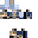
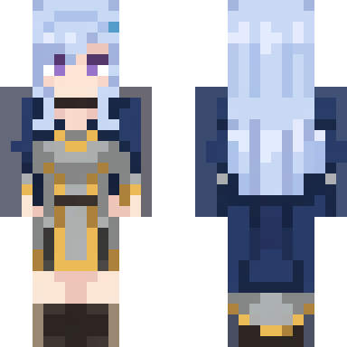
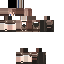
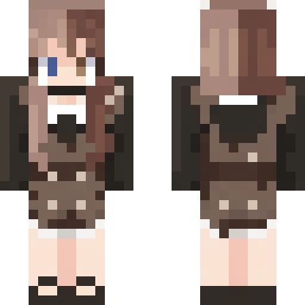
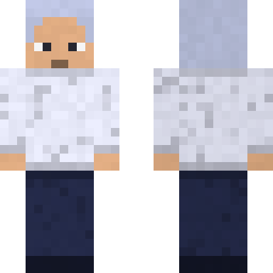

# img2skin

Turn any character image into a valid Minecraft skin.

img2skin takes a picture of a character (art, portrait, mascot, anything) and produces a ready-to-use 64x64 Minecraft skin PNG, plus a front/back preview. Generation uses Google's Nano Banana Pro image model (`gemini-3-pro-image`); everything after the single model call is deterministic image processing, so the output is always structurally valid.

## Examples

| Input | Skin (64x64) | Preview |
|---|---|---|
|  |  |  |
|  |  |  |
|  |  |  |

The first two examples are slim (3px arms); the third is wide.

## Setup

Requires Node.js 18+ and a Gemini API key ([Google AI Studio](https://aistudio.google.com/)). Each skin costs roughly $0.13 and takes 15 to 20 seconds.

```sh
git clone https://github.com/sei-studio/img2skin.git
cd img2skin
npm install
echo 'GEMINI_API_KEY=your-key-here' > .env
```

## Usage

```sh
set -a && source .env && set +a

node src/pipeline.js character.png skin.png
```

This writes `skin.png` (ready for the Minecraft launcher or a skin server) and `skin.preview.png` (front/back render).

```sh
node src/pipeline.js character.png skin.png --variant slim      # 3px arms (Alex model); default is wide
node src/pipeline.js character.png skin.png --variant wide      # 4px arms (Steve model), the default
node src/pipeline.js character.png skin.png --branch fallback   # free, no API call, see below
```

## How it works

The model is never asked to draw the flat UV atlas directly (it drifts across region boundaries between runs). Instead it renders the character as a canonical front+back dual panel, which it does consistently, and the panel is then mapped onto the atlas deterministically: bounding box detection, dominant-color grid sampling, inverse view placement, synthesized side faces, and transparency/opacity enforcement. This follows the same conclusion as the BLOCK paper (arXiv 2603.03964); see `references/NOTES.md`.

## Free no-LLM fallback

A fully deterministic generator that needs no API key: a fixed template skin (default hair style, textured shirt and pants, Steve/Alex-like skin tone, fixed eyes and mouth) recolored with the character's top colors. Primary color becomes the shirt, secondary the pants, tertiary the hair. It also runs automatically as a backup whenever the model path fails, so every input image yields a usable skin.

```sh
node src/pipeline.js character.png skin.png --branch fallback
```

| Input | LLM branch | Fallback branch |
|---|---|---|
|  |  |  |

## Layout

```
src/
  pipeline.js     CLI and end-to-end orchestration
  layout.js       64x64 UV layout (classic and slim)
  gemini.js       minimal Gemini image API client
  prompts.js      generation prompts
  panelmap.js     front+back panel to atlas projection
  downsample.js   dominant-color downsampler
  fallback.js     no-LLM template recolor generator
  enforce.js      transparency and opacity enforcement
  render.js       front/back preview renderer
  validate.js     structural validity check
assets/           reference skins
examples/         sample inputs and outputs
probe/            model layout-consistency probes
tests/            offline test suite (npm test, no API key needed)
```

## License

MIT
